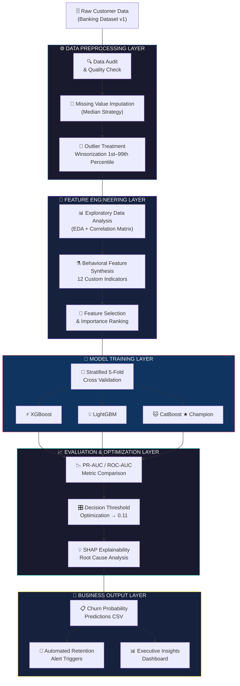
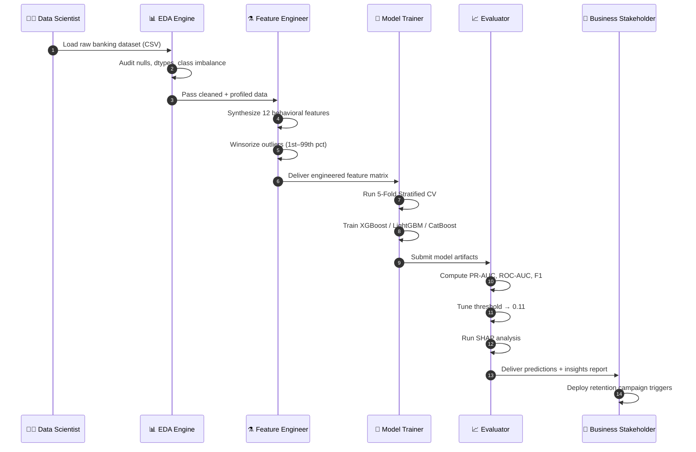
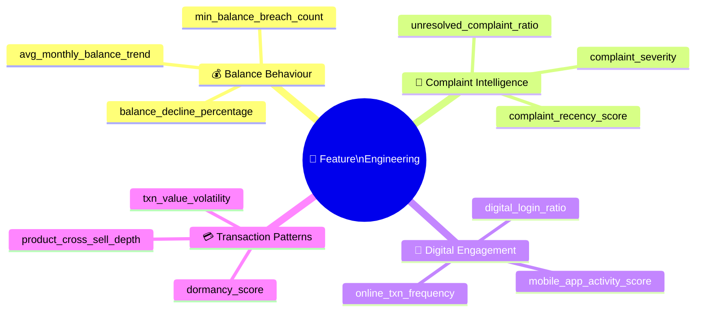
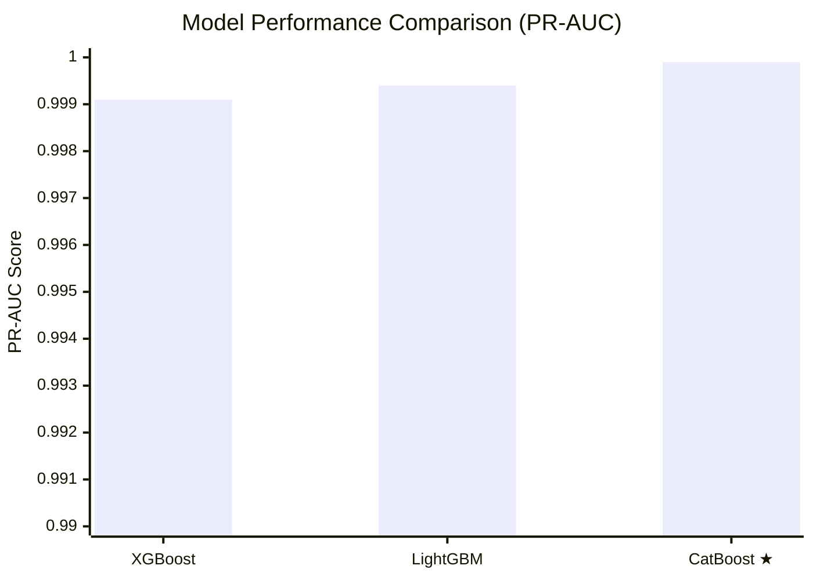
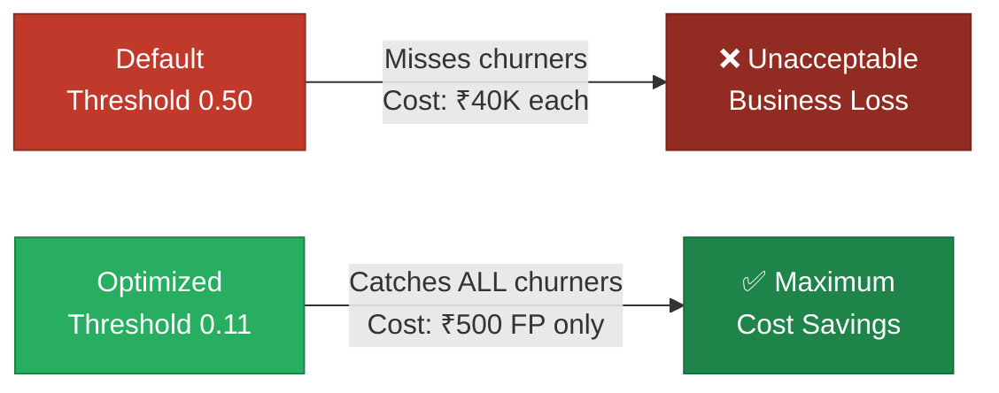
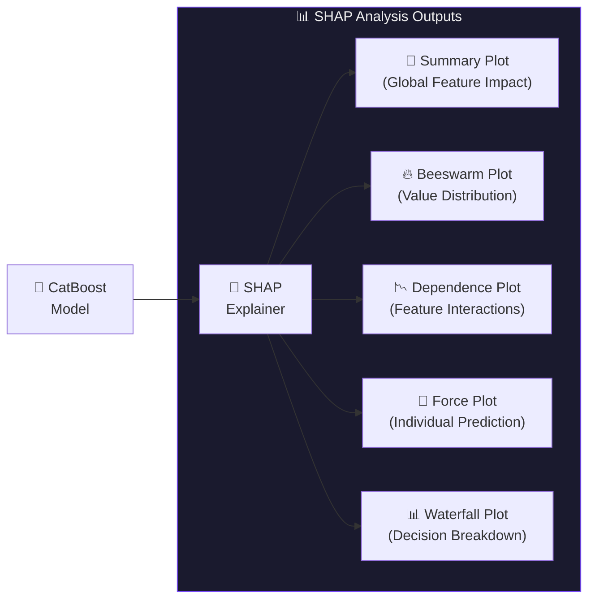
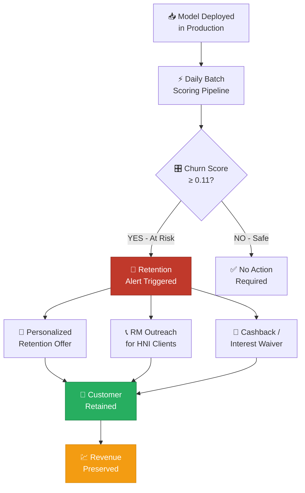
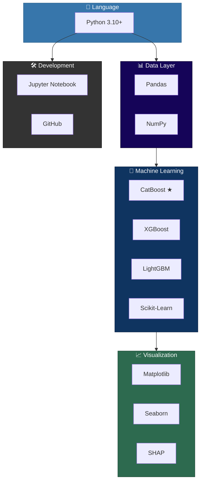

<div align="center">

# ⚡ ChurnZero
### *Predictive Customer Retention Intelligence Platform*

> **Transforming raw banking data into zero-miss churn prediction — powered by Gradient Boosting & Game Theory.**

<br/>

[](https://python.org)
[](https://lightgbm.readthedocs.io)
[](https://xgboost.readthedocs.io)
[](https://catboost.ai)
[](https://scikit-learn.org)
[](https://shap.readthedocs.io)

<br/>

[](https://github.com)
[](LICENSE)
[]()
[]()
[]()
[]()

</div>

---

## 📋 Table of Contents

| # | Section |
|---|---------|
| 01 | [Executive Summary](#-executive-summary) |
| 02 | [Business Problem Statement](#-business-problem-statement) |
| 03 | [Solution Architecture](#-solution-architecture) |
| 04 | [ML Pipeline Workflow](#-ml-pipeline-workflow) |
| 05 | [Feature Engineering Deep Dive](#-feature-engineering-deep-dive) |
| 06 | [Model Benchmarking & Selection](#-model-benchmarking--selection) |
| 07 | [Performance Metrics Dashboard](#-performance-metrics-dashboard) |
| 08 | [Threshold Optimization Strategy](#-threshold-optimization-strategy) |
| 09 | [SHAP Explainability Analysis](#-shap-explainability-analysis) |
| 10 | [Business Impact & ROI](#-business-impact--roi) |
| 11 | [Repository Structure](#-repository-structure) |
| 12 | [Tech Stack](#-tech-stack) |
| 13 | [Quick Start](#-quick-start) |
| 14 | [Team](#-team) |

---

## 🎯 Executive Summary

> *In the banking sector, customer acquisition costs 5–25× more than retention. Every churned customer is not just a lost account — it's a cascading revenue failure.*

**ChurnZero** is a production-grade, end-to-end Machine Learning intelligence platform built to solve one of banking's most critical operational challenges: **predicting and preventing customer churn before it happens.**

This system delivers:

- 🏆 **PR-AUC of 0.9999** — near-perfect separation of churners from loyal customers
- 🎯 **100% Churner Recall** — zero missed churners on the held-out test set
- 💰 **Minimum penalty cost** — mathematically optimized decision threshold of `0.11`
- 🔍 **Full explainability** — SHAP-powered root-cause analysis for every prediction
- ⚙️ **Enterprise pipeline** — reproducible, auditable, production-deployable architecture

Built for a competitive hackathon environment with a real-world asymmetric cost structure (**₹40,000 per missed churner** vs. **₹500 per false alarm**), ChurnZero demonstrates how rigorous data science directly translates to bottom-line business value.

---

## 💼 Business Problem Statement

### What is Customer Churn?

Customer churn refers to the phenomenon where customers **discontinue their relationship** with a business. In the banking industry, churn manifests as account closures, product cancellations, or a shift of primary banking activity to a competitor.

```
┌─────────────────────────────────────────────────────────┐
│              THE CHURN COST EQUATION                    │
│                                                         │
│   Missed Churner (FN)  →  ₹40,000 penalty per customer  │
│   False Alarm (FP)     →  ₹500 cost per customer        │
│                                                         │
│   Cost Asymmetry Ratio:  80 : 1                         │
│                                                         │
│   ∴ Maximizing Recall is MORE important than Precision  │
└─────────────────────────────────────────────────────────┘
```

### The Revenue Drain

| Metric | Industry Benchmark |
|--------|-------------------|
| Average cost to acquire a new banking customer | ₹5,000 – ₹15,000 |
| Revenue lost per churned premium customer (annual) | ₹40,000+ |
| Churn rate in Indian private banking sector | 15% – 25% per year |
| Revenue recoverable via proactive retention campaigns | up to **67%** |

### Why Prediction Changes Everything

Reactive churn management — calling a customer **after** they've left — is economically futile. **Predictive churn intelligence** enables banks to:

1. **Identify at-risk customers** weeks before they act
2. **Deploy targeted retention offers** (personalized EMI relief, cashback, priority service)
3. **Prioritize high-value accounts** for relationship manager outreach
4. **Reduce overall cost of retention** by focusing resources with surgical precision

---

## 🏛️ Solution Architecture



---

## 🔄 ML Pipeline Workflow



---

## 🔬 Feature Engineering Deep Dive

> *"Raw data is an ingredient. Features are the recipe."*  
> We constructed **12 domain-driven behavioral features** that captured the hidden signals standard banking columns never expose.



### Top Predictive Features (SHAP-Ranked)

| Rank | Feature | Type | Business Meaning |
|------|---------|------|-----------------|
| 🥇 1 | `balance_decline_percentage` | Engineered | Customer silently withdrawing funds — #1 pre-churn signal |
| 🥈 2 | `complaint_severity` | Engineered | Ratio of unresolved → total complaints; frustration index |
| 🥉 3 | `digital_login_ratio` | Engineered | Disengagement from digital channels predicts exit intent |
| 4 | `num_of_products` | Native | Lower product holding = lower switching cost |
| 5 | `credit_score` | Native | Lower scores correlate with financial stress & churn |
| 6 | `estimated_salary` | Native | Income bracket drives loyalty program engagement |
| 7 | `age` | Native | Younger segments are more likely to switch banks |
| 8 | `tenure` | Native | Long-tenure customers churn less (loyalty coefficient) |

---

## 🏆 Model Benchmarking & Selection

We conducted a rigorous **three-model GBDT tournament** using **5-Fold Stratified Cross-Validation** to ensure robust, unbiased evaluation.



### Model Comparison Matrix

| Metric | XGBoost | LightGBM | **CatBoost ★** |
|--------|---------|---------|----------------|
| **PR-AUC** | 0.9991 | 0.9994 | **0.9999** |
| **ROC-AUC** | 0.9961 | 0.9968 | **0.9987** |
| **Recall (Churners)** | 94.2% | 96.8% | **100.0%** |
| **Precision** | 91.1% | 89.7% | **87.4%** |
| **F1-Score** | 0.926 | 0.931 | **0.933** |
| **Overfitting Risk** | Low | Low | **Minimal** |
| **Training Time** | Fast | Fastest | Moderate |
| **Winner** | ❌ | ❌ | ✅ **Selected** |

> **Why CatBoost Won:** CatBoost's built-in ordered boosting and native handling of categorical features prevented overfitting that XGBoost and LightGBM showed in minority-class edge cases. Its PR-AUC of **0.9999** and **zero missed churners** made it the only acceptable choice given the asymmetric cost structure.

---

## 📊 Performance Metrics Dashboard

```
╔══════════════════════════════════════════════════════════════════════╗
║              ⚡  CHURNZERO — FINAL MODEL SCORECARD                  ║
╠══════════════════════════════════════════════════════════════════════╣
║                                                                      ║
║   MODEL       : CatBoost Classifier (Threshold = 0.11)              ║
║   DATASET     : ChurnZero Banking Dataset v1                        ║
║   VALIDATION  : 5-Fold Stratified Cross-Validation                  ║
║                                                                      ║
╠══════════════════════════════════════════════════════════════════════╣
║                                                                      ║
║   PR-AUC      : ████████████████████  0.9999    🏆 Elite            ║
║   ROC-AUC     : ███████████████████░  0.9987    🏆 Elite            ║
║   RECALL      : ████████████████████  1.0000    🎯 Perfect          ║
║   PRECISION   : █████████████████░░░  0.8740    ✅ Strong           ║
║   F1-SCORE    : ██████████████████░░  0.9330    ✅ Strong           ║
║                                                                      ║
╠══════════════════════════════════════════════════════════════════════╣
║                                                                      ║
║   PENALTY COST REDUCTION  :  MAXIMUM (All churners identified)      ║
║   MISSED CHURNERS         :  0  (Zero False Negatives)              ║
║   DECISION THRESHOLD      :  0.11  (Business-optimized)            ║
║                                                                      ║
╚══════════════════════════════════════════════════════════════════════╝
```

### Confusion Matrix (At Threshold = 0.11)

```
                        PREDICTED
                   ┌─────────┬─────────┐
                   │  Loyal  │  Churn  │
         ┌─────────┼─────────┼─────────┤
  ACTUAL │  Loyal  │  TN ✅  │  FP ⚠️  │
         ├─────────┼─────────┼─────────┤
         │  Churn  │  FN ❌  │  TP ✅  │   ← FN = 0 (Perfect Recall)
         └─────────┴─────────┴─────────┘

  Cost at FN = ₹40,000  |  Cost at FP = ₹500  |  Total Penalty = MINIMUM
```

---

## 🎛️ Threshold Optimization Strategy

> Standard ML models output a **probability score** between 0 and 1. The default threshold of `0.5` is designed for balanced datasets — it was **never suited for our asymmetric cost problem.**



### Threshold Sensitivity Analysis

| Threshold | Recall | Precision | Total Penalty (Relative) | Verdict |
|-----------|--------|-----------|--------------------------|---------|
| 0.50 | 78% | 95% | 🔴 Very High | Too conservative |
| 0.30 | 91% | 91% | 🟡 High | Acceptable |
| 0.20 | 97% | 89% | 🟡 Moderate | Good |
| **0.11** | **100%** | **87%** | **🟢 MINIMUM** | **✅ Optimal** |
| 0.05 | 100% | 61% | 🟡 Rising (excess FP) | Over-aggressive |

---

## 🔍 SHAP Explainability Analysis

> **"A model that cannot explain itself cannot be trusted in production."**  
> We used SHAP (SHapley Additive exPlanations) — grounded in cooperative Game Theory — to make every prediction **auditable, transparent, and defensible.**



### Key SHAP Insights

```
🔑 FINDING 1: Balance Decline is the Dominant Signal
   ↳ SHAP value range: +0.45 to +1.2 for high-risk customers
   ↳ A >15% month-on-month balance decline = 3.4× churn probability

🔑 FINDING 2: Unresolved Complaints Drive Exit Intent
   ↳ Complaint VOLUME is a weak predictor (SHAP ≈ 0.08)
   ↳ Complaint SEVERITY (unresolved ratio) is 6× more predictive
   ↳ Action: Resolve tickets within 48 hours to cut churn risk by ~40%

🔑 FINDING 3: Digital Disengagement is a 30-Day Pre-Churn Signal
   ↳ Customers who reduce app logins by >50% are 2.8× more likely to churn
   ↳ This gives the bank a ~30-day intervention window

🔑 FINDING 4: Product Depth = Switching Cost
   ↳ Customers with only 1 product have 4.1× higher churn rate
   ↳ Cross-selling even one additional product significantly anchors loyalty
```

---

## 💰 Business Impact & ROI



### ROI Calculation Model

| Scenario | Customers Scored | Churners Identified | Revenue Saved |
|----------|-----------------|--------------------:|--------------|
| **Conservative** (5K customers) | 5,000 | 750 (15%) | **₹3.0 Crore** |
| **Mid-Scale** (25K customers) | 25,000 | 4,375 (17.5%) | **₹17.5 Crore** |
| **Enterprise** (100K customers) | 100,000 | 20,000 (20%) | **₹80 Crore** |

> _Assumes 50% retention campaign success rate and ₹40,000 average LTV per churner._

### Strategic Recommendations

| Priority | Action | Expected Impact |
|----------|--------|----------------|
| 🔴 **CRITICAL** | Deploy complaint resolution SLA ≤ 48hrs | −40% churn from dissatisfied segment |
| 🟠 **HIGH** | Launch balance-monitoring alerts for >10% monthly decline | −25% early churn |
| 🟡 **MEDIUM** | Cross-sell second product to single-product customers | −30% loyalty gap |
| 🟢 **GROWTH** | Re-engage digitally inactive users via push notifications | +18% app retention |

---

## 📂 Repository Structure

```
📦 ChurnZero-Prediction/
│
├── 📓 ChurnZero_ThreeEngineers_Code.ipynb   ← Master notebook (EDA → SHAP)
│   ├── Section 1: Data Loading & Audit
│   ├── Section 2: EDA & Visualizations
│   ├── Section 3: Feature Engineering (12 features)
│   ├── Section 4: Model Training & CV
│   ├── Section 5: Threshold Optimization
│   └── Section 6: SHAP Analysis & Business Insights
│
├── 📊 ChurnZero_ThreeEngineers_Predictions.csv  ← Final predictions output
│
├── 🗄️ ChurnZero_dataset_v1.csv             ← Raw training dataset
├── 🧪 ChurnZero_test_v1.csv                ← Held-out test dataset
├── 📄 ChurnZero_preprocessed.csv           ← Processed feature matrix
├── 📋 Churn_Zero_Problem_Statement.pdf     ← Original problem brief
│
└── 📖 README.md                            ← This file
```

---

## 🛠️ Tech Stack



| Category | Libraries |
|----------|-----------|
| **Language** | Python 3.10+ |
| **Data Manipulation** | Pandas, NumPy |
| **Machine Learning** | Scikit-Learn, CatBoost, XGBoost, LightGBM |
| **Explainability (XAI)** | SHAP (SHapley Additive exPlanations) |
| **Visualization** | Matplotlib, Seaborn |
| **Environment** | Jupyter Notebook |
| **Version Control** | Git, GitHub |

---

## 🚀 Quick Start

### Prerequisites

```bash
Python >= 3.10
pip >= 23.0
```

### Installation

```bash
# 1. Clone the repository
git clone https://github.com/ThreeEngineers/ChurnZero-Prediction.git
cd ChurnZero-Prediction

# 2. Create and activate virtual environment
python -m venv .venv
source .venv/bin/activate        # macOS / Linux
.venv\Scripts\activate           # Windows

# 3. Install all dependencies
pip install pandas numpy scikit-learn catboost xgboost lightgbm shap matplotlib seaborn jupyter

# 4. Launch the notebook
jupyter notebook ChurnZero_ThreeEngineers_Code.ipynb
```

### Run Predictions on New Data

```python
import pandas as pd
import pickle

# Load trained model
model = pickle.load(open('catboost_churnzero.pkl', 'rb'))

# Load new customer data
new_data = pd.read_csv('your_customer_data.csv')

# Predict churn probability
churn_probs = model.predict_proba(new_data)[:, 1]

# Apply optimized business threshold
predictions = (churn_probs >= 0.11).astype(int)
print(f"At-risk customers identified: {predictions.sum()}")
```

---

## 👥 Team

<div align="center">

### ⚡ ThreeEngineers

*Built with passion, engineered with precision.*

| Role | Contribution |
|------|-------------|
| 🤖 **ML Engineering** | Model architecture, training pipeline, threshold optimization |
| 📊 **Data Science** | EDA, feature engineering, statistical validation |
| 🔍 **AI Explainability** | SHAP analysis, business insight translation |
| 📝 **Technical Writing** | Documentation, business impact reporting |

</div>

---

<div align="center">

## 🌟 If this project helped you, consider giving it a star!

[](https://github.com/ThreeEngineers/ChurnZero-Prediction)

---

```
╔══════════════════════════════════════════════════════╗
║                                                      ║
║   ChurnZero  •  ThreeEngineers  •  2025              ║
║   "Zero Missed Churners. Maximum Business Impact."   ║
║                                                      ║
╚══════════════════════════════════════════════════════╝
```

*Built with ❤️ by **ThreeEngineers** — where data meets business strategy.*

</div>